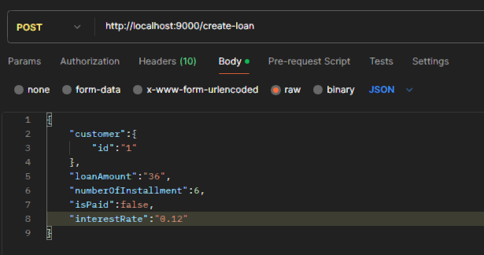

# randstad

case study for randstad

This is a Java / Maven / Spring Boot (version 3.4.1) / H2DB application.

## How to Run

You run it using the ```java -jar``` command.

* Clone this repository
* You can build the project by running ```mvn clean package```

```
    java -jar target/randstad-1-SNAPSHOT.war
```

## How to Use

Once the application runs, create some records via h2 console at http://localhost:9000/h2-console

create an admin user record as an example below

```
INSERT INTO users(id,username,password) VALUES (1,'adminuser','123456');
```

create some customer records as an example below

```
INSERT INTO customers(id,name,surname,credit_limit,used_credit_limit) VALUES (1,'ozan','altintas', 100, 0);
INSERT INTO customers(id,name,surname,credit_limit,used_credit_limit) VALUES (2,'dilan','agirbas', 200, 0);
```

authorize with header in post request as show below


### Create Loan



* response
  

### List Loan


you can use "numberOfInstallments" or "isPaid" parameters for filter the result set

* response
  

### List Installments


* response
  

### Pay Loan


* response
  

